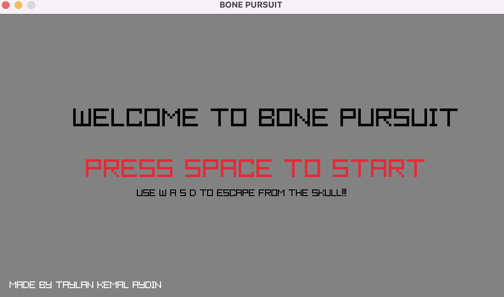
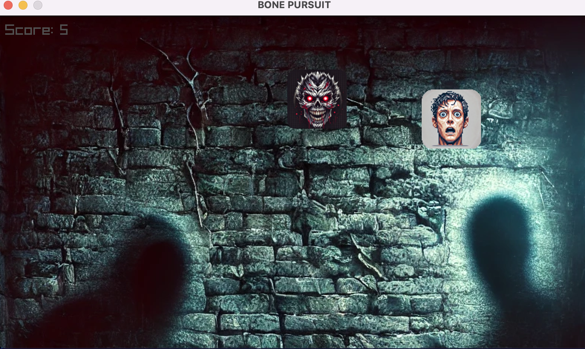
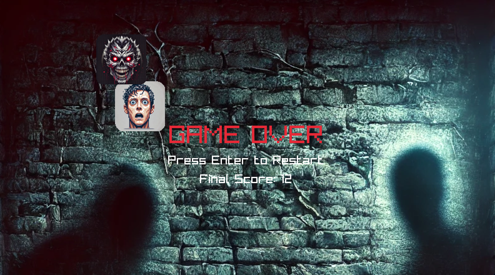

# BONE PURSUIT

🎮 **A 2D horror-themed escape game built with C++ and Raylib.**


## 🚀 Features
- Use `W`, `A`, `S`, `D` keys to control the player and escape from the skull enemy.
- Dynamic difficulty progression as your score increases.
- Immersive background music and sound effects.


## 🛠️ Technologies Used
- **C++**: Core game logic.
- **Raylib**: Graphics and sound engine for the game.
- **Custom Game Assets**: Unique textures, sounds, and animations.


## 🎮 Gameplay Screenshots
### Main Menu


### Gameplay


### Game Over



## ⚙️ Game Progression
The game becomes harder as your score increases:
- **Score > 25**: Enemy speed increases to 250.
- **Score > 50**: Enemy speed increases to 300.
- **Score > 100**: Enemy speed increases to 400.


## 🎵 Sound and Music
- Background music: `musicmain.mp3`
- Game over sound: `musicgameover.mp3`


## 💡 Credits
- **Developed by Taylan Kemal Aydın**.
- Special thanks to Raylib for providing a lightweight game engine.


- ## 📖 How to Run
To run the game, first clone the repository and navigate to the project directory. Use the `make` command to compile the game, then execute the `./BonePursuit` command to run it. If you want to clean up compiled files, you can use the `make clean` command. Below are the required terminal commands:

```bash
git clone https://github.com/taylnAydin/Bone-Pursuit.git
cd Bone-Pursuit
make
./BonePursuit
make clean


